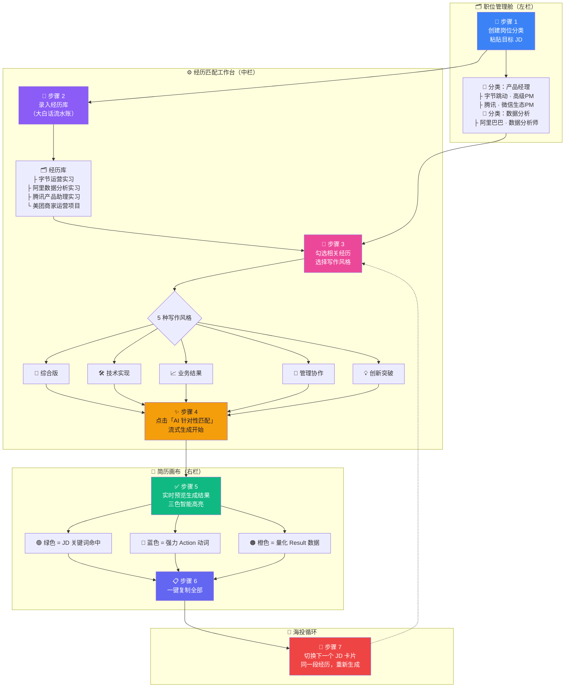
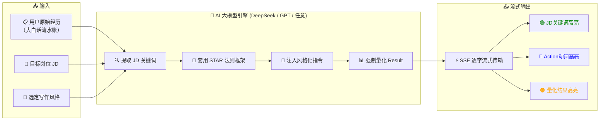
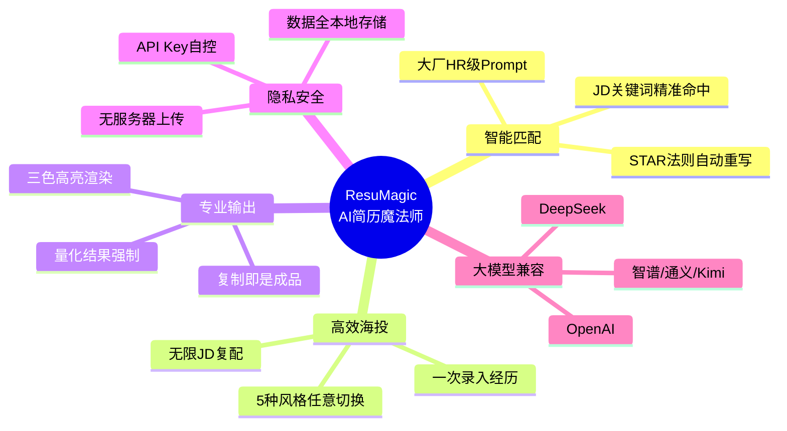

# 🧙 ResuMagic — AI 简历魔法师 产品流程图

> **让 AI 读懂 JD，把你的大白话经历一键重写成 STAR 法则专业简历。**

---

## 📌 用户操作全流程（7 步，从大白话到成品简历）

---

## 🧠 AI 引擎内部流程

---

## 💡 核心卖点一图流

---

## 🎯 一句话总结

> **ResuMagic = 你的私人简历参谋部。把经历丢进去，AI 帮你对齐 JD、重构措辞、量化结果、三色高亮——复制粘贴就是一份专为该岗位定制的 STAR 简历。**

🌐 立即体验：[resu-magic-d3fp.vercel.app](https://resu-magic-d3fp.vercel.app)
📄 流程图页面：[resu-magic-d3fp.vercel.app/flowchart.html](https://resu-magic-d3fp.vercel.app/flowchart.html)
